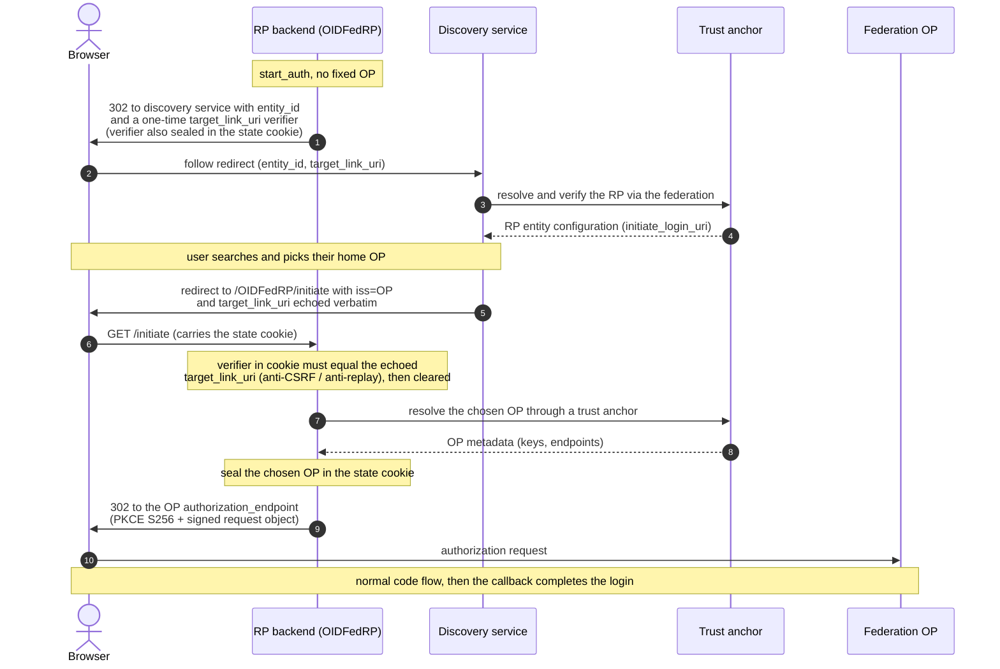

# Built-in plugin reference

This chapter is the per-plugin **config reference**: one TOML example per
plugin `type`, with every key explained inline. It is organized by the three
plugin kinds:

- **[Frontends](#frontends)** speak a protocol *downstream* to relying parties
  and service providers - they are the entry point a user-facing application
  talks to. tunnelbana is an OpenID Provider, a federation OP, or a SAML IdP
  here.
- **[Backends](#backends)** speak a protocol *upstream* to the identity
  providers and OPs that actually authenticate the user. tunnelbana is a
  relying party, a federation RP, or a SAML SP here.
- **[Micro-services](#micro-services)** sit *in the middle* and reshape the
  attributes/identity as a flow passes between a frontend and a backend. The
  [micro-services chapter](micro-services.md) covers their semantics and
  ordering; this chapter is the config reference for each one.

A single tunnelbana instance combines one or more frontends, one or more
backends, and any number of micro-services; how a flow is steered from a
frontend to a backend is [backend selection](configuration.md#backend-selection).

## The plugin catalogue

### Frontend types

| `type` | Role | Section |
| --- | --- | --- |
| `oidc` | OpenID Provider (OP) | [reference](#oidc-frontend---openid-provider) |
| `oidc_federation` | OpenID Federation 1.1 OP | [reference](#oidc_federation-frontend---federation-op) |
| `saml2` | SAML2 Identity Provider (IdP) | [reference](#saml2-frontend---identity-provider) |

### Backend types

| `type` | Role | Section |
| --- | --- | --- |
| `oidc` | OpenID Connect Relying Party (RP) | [reference](#oidc-backend---relying-party) |
| `oidc_federation` | OpenID Federation 1.1 RP (automatic registration) | [reference](#oidc_federation-backend---federation-relying-party) |
| `saml2` | SAML2 Service Provider (SP) | [reference](#saml2-backend---service-provider) |

### Micro-service types

The **path** column says which half of the flow the service runs on: a
*request-path* service runs on the way from the frontend to the backend (and
can steer backend selection); a *response-path* service runs on the way back,
once the backend has produced attributes. See
[where they run](micro-services.md#where-they-run-in-the-pipeline).

| `type` | Path | What it does |
| --- | --- | --- |
| `static_attributes` | response | Inject fixed attributes (does not overwrite existing ones). |
| `filter_attributes` | response | Allow-list whole attributes, globally or per requester. |
| `filter_attribute_values` | response | Drop attribute *values* not matching a regex, per provider/requester. |
| `rename_attributes` | response | Rename internal attributes (values merge on collision). |
| `attribute_processor` | response | Per-attribute transform chains: regex, hash, scope, gender. |
| `attribute_generation` | response | Synthesize attributes from Tera templates. |
| `attribute_authorization` | response | Reject flows whose attributes fail regex allow/deny rules. |
| `hasher` | response | Salted-hash the subject id / attributes per requester. |
| `primary_identifier` | response | Construct a primary id from ordered candidates. |
| `custom_logging` | response | Append a per-flow JSON audit record to a file. |
| `custom_routing` | request | Pick a backend by requester or target issuer. |
| `idp_hinting` | request | Lift an IdP-hint query parameter into the flow. |

All `signing_*` keys follow the [key-loading rules](configuration.md#keys-pem-or-jwk).
The attribute transforms above have a narrative, worked-example walkthrough in
[Attributes and transforms](attributes.md).

## Frontends

A frontend is mounted at `<base_url>/<name>` and serves the protocol endpoints a
downstream application talks to. List one `[[frontend]]` table per entry point;
a single instance can run several frontends side by side (for example a SAML
IdP and an OIDC OP over the same backend).

### `oidc` frontend - OpenID Provider

```toml
[[frontend]]
type = "oidc"
name = "OIDC"
  [frontend.config]
  signing_key_path  = "keys/op.key"   # id_token signing key
  signing_algorithm = "ES256"
  signing_key_id    = "op-key-1"
  code_ttl          = 600             # seconds (default 600)
  access_token_ttl  = 3600            # seconds (default 3600)
  id_token_ttl      = 3600            # seconds (default 3600)
  refresh_token_ttl = 2592000         # seconds (default 2592000 = 30 days)
  # Optional: pin every flow from this frontend to a named backend, overriding
  # custom_routing and the default backend (see Backend selection). Omit to let
  # routing micro-services / the default backend decide.
  # backend         = "Saml2"

  [frontend.config.dpop]
  enabled             = true           # default false
  proof_max_age_secs  = 300            # default 300
  require_nonce       = false          # default false
  nonce_lifetime_secs = 300            # default 300

  # Optional: load extra clients from an external JSON file, merged with the
  # inline `clients` below (see "Client roster from a file"). Path is read
  # as-given (relative to the working directory).
  # clients_file    = "clients/oidc-rps.json"

  # Statically registered clients (repeat the table per client).
  [[frontend.config.clients]]
  client_id                  = "demo-rp"
  client_secret              = "demo-rp-secret"
  redirect_uris              = ["https://rp.example.com/callback"]
  response_types             = ["code"]
  token_endpoint_auth_method = "client_secret_basic"
  # grant_types defaults to ["authorization_code"]. Add "refresh_token" to issue
  # a refresh token from the code exchange and accept grant_type=refresh_token;
  # add "client_credentials" for the service-to-service grant.
  grant_types                = ["authorization_code", "refresh_token"]

  # Optional: extra fields merged into the discovery document.
  [frontend.config.extra_metadata]
  # e.g. service_documentation = "https://…"
```

#### Client roster from a file

Both the `oidc` and `oidc_federation` frontends accept an optional
`clients_file` pointing at a JSON file that holds a **bare array** of client
objects (same fields as an inline `[[frontend.config.clients]]` table). It is
useful when the roster is large or machine-generated and you want it out of the
main config while keeping keys, TTLs, and other settings inline.

```json
[
  {
    "client_id": "demo-rp",
    "client_secret": "demo-rp-secret",
    "redirect_uris": ["https://rp.example.com/callback"],
    "response_types": ["code"],
    "grant_types": ["authorization_code"],
    "token_endpoint_auth_method": "client_secret_basic"
  }
]
```

- The file's clients are **merged** with any inline `clients` (inline first,
  then file).
- A **duplicate `client_id`** anywhere in the merged set is a fail-fast boot
  error - the roster never silently shadows another client's secret or redirect
  URIs.
- An **unknown field** in a file entry (e.g. `redirect_uri` instead of
  `redirect_uris`) is rejected at boot rather than silently dropped, so a typo
  cannot quietly yield a half-configured client.
- The path is read **as-given** (relative to the process working directory, like
  `signing_key_path`), and `${ENV}` interpolation applies. The file is read
  **once at startup**; editing it requires a restart.
- Only the JSON format is accepted (a bare array). To externalize the *entire*
  frontend config instead, use the [`include`](configuration.md#splitting-config-out-with-include)
  directive (ADR 0028).

Serves `…/OIDC/.well-known/openid-configuration`, `…/OIDC/jwks`,
`…/OIDC/authorization`, `…/OIDC/token`, `…/OIDC/userinfo`. Supports the code
flow with PKCE, the `client_credentials` grant for confidential clients, the
`refresh_token` grant (RFC 6749 §6) for clients that register it, and the
`client_secret_basic`, `client_secret_post`, `none` and `private_key_jwt`
token-endpoint auth methods. Refresh tokens are stateless (a sealed,
self-contained token) and are rotated on each use; like all tokens here they
carry their own expiry and cannot be revoked server-side before that expiry
elapses.

When `frontend.config.dpop.enabled = true`, the
frontend advertises `dpop_signing_alg_values_supported = ["ES256"]`, accepts
DPoP proofs on the token and userinfo endpoints, and issues sender-constrained
access tokens (`token_type = "DPoP"`).

### `oidc_federation` frontend - Federation OP

A federation-aware OP: it serves a signed entity configuration, auto-registers
unknown RPs by resolving them through a trust anchor, unpacks request objects
(RFC 9101) and accepts `private_key_jwt` (RFC 7523).

```toml
[[frontend]]
type = "oidc_federation"
name = "OIDFed"
  [frontend.config]
  # Federation entity identifier. Defaults to <base_url>/<name>; set it to a
  # stable id (e.g. the bare host) independent of where endpoints are mounted.
  entity_id         = "https://op.example.com"
  # OIDC id_token signing key.
  signing_key_path  = "keys/oidc_signing.key"
  signing_algorithm = "RS256"
  signing_key_id    = "oidc-key-1"
  # Optional: pin every flow from this frontend to a named backend, overriding
  # custom_routing and the default backend (see Backend selection).
  # backend         = "Saml2"
  # Optional: seed statically pre-registered clients from a JSON file (see
  # "Client roster from a file"). These coexist with RPs the federation OP
  # auto-registers at runtime through the trust chain.
  # clients_file    = "clients/oidfed-rps.json"

  [frontend.config.federation]
  # Federation signing key - signs the entity configuration.
  signing_key_path              = "keys/federation_ec.key"
  signing_algorithm             = "ES256"
  signing_key_id                = "federation-key-1"
  authority_hints               = ["https://ta.example.com"]
  organization_name             = "Example OP"
  organization_uri              = "https://example.com"
  entity_configuration_lifetime = 86400   # seconds (default 86400)
  rp_cache_ttl                  = 3600    # auto-registered RP cache TTL (default 3600)
  trust_marks                   = []      # optional array of trust-mark JWTs

  # One table per trust anchor; `keys` are the anchor's pinned JWKS.
  [[frontend.config.federation.trust_anchor]]
  entity_id = "https://ta.example.com"
  keys = [
    { kty = "EC", crv = "P-256", x = "…", y = "…", kid = "ta-1", use = "sig", alg = "ES256" },
  ]
```

The entity configuration is served at `…/OIDFed/.well-known/openid-federation`
(see the [reverse-proxy note](configuration.md#mount-points) for exposing it on
the bare host). The OIDC endpoints mirror the plain `oidc` frontend, under
`…/OIDFed/`.

### `saml2` frontend - Identity Provider

```toml
[[frontend]]
type = "saml2"
name = "Saml2IDP"
  [frontend.config]
  idp_entity_id            = "https://idp.example.com/Saml2IDP"  # default <base_url>/<name>
  idp_key_path             = "keys/saml_idp.key"   # signing key (PEM)
  idp_cert_path            = "keys/saml_idp.crt"   # cert (PEM), published in metadata
  assertion_lifetime_seconds = 300                 # default 300
  sign_assertions          = true                  # default true
  sign_responses           = false                 # default false (see note)
  # Supported NameID formats in preference order; the first is the default
  # when the SP states no NameIDPolicy. A requested format outside the list
  # is answered with an InvalidNameIDPolicy SAML error at the SP's ACS.
  # "transient" mints a fresh random opaque value per response.
  name_id_formats          = ["urn:oasis:names:tc:SAML:2.0:nameid-format:persistent"]
  # name_id_format = "…"   # single-value alias; do not set both forms
  authn_context_class_ref  = "urn:oasis:names:tc:SAML:2.0:ac:classes:PasswordProtectedTransport"
  # "basic" (default) emits plain attribute names; "uri" emits OID names +
  # FriendlyName from the attribute map (SWAMID-style).
  attribute_name_format    = "basic"
  # Require signed AuthnRequests even when the SP's metadata does not say
  # AuthnRequestsSigned="true". Also advertised in IdP metadata.
  want_authn_requests_signed = false
  # Optional: pin every flow from this frontend to a named backend, overriding
  # custom_routing and the default backend (see Backend selection).
  # backend                  = "OidcUpstream"

  # REQUIRED: registered SP metadata (see the security note below).
  [frontend.config.metadata]
  local = ["metadata/sp1.xml", "metadata/federation-sps.xml"]
  # Optional MDQ source for SPs not found in the local files; the role
  # requirement is forced to "sp". Same keys as the backend's [mdq] table.
  # [frontend.config.metadata.mdq]
  # url               = "https://mdq.swamid.se/entities/"
  # signing_cert_path = "keys/mdq-signer.crt"

  # Optional per-SP attribute release policy (internal attribute names).
  # The SP-specific entry replaces "default" (no merge); no matching entry
  # (or no attribute_restrictions) releases everything.
  # [frontend.config.policy.default]
  # attribute_restrictions = ["mail", "edupersonprincipalname"]
  # [frontend.config.policy."https://sp.example.org"]
  # attribute_restrictions = ["mail"]

  # Optional: published in IdP metadata (needed for e.g. SWAMID registration).
  # [frontend.config.organization]
  # name = "SUNET"
  # display_name = "Sunet"
  # url = "https://example.com"
  # lang = "en"                       # default "en"
  # [[frontend.config.contact_person]]
  # contact_type  = "technical"       # technical|support|administrative|billing|other
  # email_address = "noc@example.com"
  # given_name    = "Ops"
```

> **Security: registered SPs are mandatory.** Every AuthnRequest's issuer is
> resolved against the `[frontend.config.metadata]` store (local files are
> `EntityDescriptor` or `EntitiesDescriptor` documents; MDQ fills the gaps).
> Unknown SPs get a **403**, and the ACS URL is validated against the SP's
> registered `AssertionConsumerService`s - assertions are never delivered to a
> URL taken from the request. Without this an attacker who knows the SSO URL
> could exfiltrate signed assertions to an arbitrary ACS. The frontend
> therefore **refuses to start** without a metadata source; the dev-only
> escape hatch is `allow_unknown_sps = true` (logged loudly, never use it in
> production). When a signature is required (SP metadata or
> `want_authn_requests_signed`), redirect-binding signatures are verified over
> the raw query string and POST-binding requests via their enveloped XML
> signature, against the SP's metadata-registered signing certs. See ADR 0006.

> **Signing.** By default tunnelbana signs the **assertion** only, which is the
> common interoperable pattern: an SP that verifies the single assertion
> signature is satisfied. Set `sign_responses = true` to also sign the Response
> envelope. (Conversely, the [SAML SP backend](#saml2-backend---service-provider)
> accepts either a signed assertion **or** a signed Response.)

The IdP serves `…/Saml2IDP/sso` (Redirect + POST) and `…/Saml2IDP/metadata`.
When `idp_entity_id` is itself a URL under the module base (the common
`…/Saml2IDP/proxy.xml` convention), the metadata document is additionally
served at that path (SATOSA's `entityid_endpoint`).

## Backends

A backend is the upstream side: it sends the user to an external IdP or OP,
receives the response, and hands tunnelbana the resulting `InternalData`. Its
own callback/ACS endpoints are mounted under `<base_url>/<name>`. With more than
one backend, [backend selection](configuration.md#backend-selection) decides
which one a given flow uses.

### `oidc` backend - Relying Party

```toml
[[backend]]
type = "oidc"
name = "Upstream"
  [backend.config]
  # Either discover from the issuer…
  issuer                     = "https://accounts.upstream.example"
  # …or pin endpoints explicitly:
  # authorization_endpoint   = "https://…/authorize"
  # token_endpoint           = "https://…/token"
  # userinfo_endpoint        = "https://…/userinfo"
  # jwks_uri                 = "https://…/jwks"

  client_id                  = "tunnelbana-rp"
  client_secret              = "upstream-rp-secret"      # for client_secret_* methods
  token_endpoint_auth_method = "client_secret_basic"
  scope                      = "openid profile email"

  # For private_key_jwt, supply a signing key instead of a secret:
  # signing_key_path  = "keys/rp.key"
  # signing_algorithm = "ES256"
  # signing_key_id    = "rp-key-1"
```

Always uses PKCE (S256). The callback is served at `…/Upstream/`.

### `oidc_federation` backend - Federation Relying Party

The federation-aware RP (ADR 0024): no pre-registered client, no
`.well-known` discovery. The proxy publishes its own signed RP entity
configuration, resolves the upstream OP through the configured trust
anchors, and authenticates with `private_key_jwt` using its **entity id as
the client id** (automatic registration, OpenID Federation 1.1 section 12.1).

```toml
[[backend]]
type = "oidc_federation"
name = "OIDFedRP"
  [backend.config]
  # Federation entity id of this RP and the client_id sent upstream.
  # Defaults to <base_url>/<name>. The entity configuration must be
  # reachable at <entity_id>/.well-known/openid-federation (reverse-proxy
  # rewrite when you publish a bare-host entity id).
  # entity_id = "https://rp.example.com"

  # The upstream OP to authenticate against (its federation entity id).
  # Mutually exclusive with [backend.config.discovery]; set exactly one.
  op_entity_id = "https://op.example.org"
  scope        = "openid profile email"

  # Instead of a fixed op_entity_id, enable OP discovery: send the user to an
  # external OpenID Federation discovery service (e.g. upptackt) which returns
  # the chosen OP to <name>/initiate as a third-party initiated login
  # (ADR 0025).
  # [backend.config.discovery]
  # enable  = true
  # service = "https://discovery.example.com"

  # Optional dedicated private_key_jwt key; defaults to the federation key.
  # signing_key_path  = "keys/rp_oidc.key"
  # signing_algorithm = "ES256"
  # signing_key_id    = "rp-oidc-1"

  [backend.config.federation]
  # Federation signing key: signs the RP entity configuration.
  signing_key_path              = "keys/rp_federation.key"
  signing_algorithm             = "ES256"
  signing_key_id                = "rp-fed-1"
  authority_hints               = ["https://ta.example.com"]
  organization_name             = "Example RP"
  entity_configuration_lifetime = 86400   # seconds (default 86400)
  op_cache_ttl                  = 3600    # resolved OP metadata TTL (default 3600)

  # One table per trust anchor; `keys` are the anchor's pinned JWKS.
  [[backend.config.federation.trust_anchor]]
  entity_id = "https://ta.example.com"
  keys = [
    { kty = "EC", crv = "P-256", x = "…", y = "…", kid = "ta-1", use = "sig", alg = "ES256" },
  ]
```

How a flow works:

1. `start_auth` picks the OP. With a fixed `op_entity_id` it resolves that OP
   through a trust anchor's `federation_resolve_endpoint` (the response is a
   `resolve-response+jwt` verified against the pinned anchor keys) and caches
   the result for `op_cache_ttl` seconds. With **discovery** enabled it
   instead redirects the browser to the external discovery service (see
   below).
2. The user is redirected to the resolved `authorization_endpoint` with
   `client_id = <entity_id>`, PKCE (S256), a **signed request object**
   (RFC 9101, signed with the `private_key_jwt` key - federation OPs doing
   automatic registration authenticate the RP with it; plain parameters are
   kept alongside for OPs that ignore it), and `state`/`nonce` (plus the
   chosen OP) sealed in the encrypted state cookie.
3. The callback (`…/OIDFedRP/callback`) checks the state, exchanges the code
   at the resolved `token_endpoint` with a `private_key_jwt` assertion, and
   verifies the id_token (issuer, audience, nonce) against the OP keys that
   arrived **inline in the resolved metadata**; `jwks_uri` is only fetched
   when no inline keys exist.
4. id_token claims (merged with userinfo when advertised) map through the
   `openid` attribute profile; the subject is reported as `pairwise`.

The RP entity configuration is served at
`…/OIDFedRP/.well-known/openid-federation` and publishes exactly what a
federation OP's automatic registration needs: `redirect_uris`,
`client_registration_types = ["automatic"]`,
`token_endpoint_auth_method = "private_key_jwt"`, and the client-auth public
`jwks` (the entity configuration's own top-level `jwks` carries the
federation keys; the two key sets are deliberately separate). At least one
`trust_anchor` is required at startup.

> **Pairing note:** the publishing shape matches what the `oidc_federation`
> **frontend** consumes when auto-registering RPs, so two tunnelbana
> instances can attach to each other across a federation with no manual
> registration on either side.

#### OP discovery

With `[backend.config.discovery]` instead of a fixed `op_entity_id`, the
backend delegates the per-flow OP choice to an **external OpenID Federation
discovery service** such as [upptackt](https://github.com/SUNET/upptackt)
(ADR 0025).

The flow at a glance:



In detail:

1. `start_auth` 302s to `service?entity_id=<rp_entity_id>&target_link_uri=…`.
   The `target_link_uri` is a **one-time return-path verifier**:
   `…/OIDFedRP/initiate?tb_discovery_verifier=<random token>`, with the
   token also stored in the encrypted state cookie. If a request-path
   micro-service pinned an upstream via the `KEY_TARGET_ENTITYID` decoration
   (e.g. `idp_hinting`), it is forwarded as `hint`; an invalid hint is
   dropped, not fatal.
2. The discovery service verifies the RP through the federation (it resolves
   the RP's entity configuration, where this backend publishes
   `initiate_login_uri = …/OIDFedRP/initiate` in discovery mode), lets the
   user search and pick an OP, and sends the user back to
   `…/OIDFedRP/initiate?iss=<op>&target_link_uri=<echoed verbatim>` - an
   OpenID Connect Core §4 Third-Party Initiated Login.
3. `initiate` accepts the return only when a discovery flow is actually in
   flight (the verifier stored in the encrypted state cookie by
   `start_auth`) **and** the echoed `target_link_uri` exactly matches the
   verifier URL emitted in step 1 - binding the return to that specific
   outgoing redirect (anti-CSRF/anti-replay; the verifier is cleared after
   use). It then validates `iss` as an https entity id and continues exactly
   as the fixed-OP path: the OP must resolve through the configured trust
   anchors, and the chosen OP is sealed in the state cookie so the callback
   resolves the same OP. The `target_link_uri` is only ever compared, never
   used as a redirect target - the proxy's continuation rides the state
   cookie, never a caller-supplied URL.

`op_entity_id` and `discovery.enable` are mutually exclusive and validated at
startup; `discovery.enable` requires `service` (the URL is also validated at
startup). The `initiate` route is only registered in discovery mode.

> An earlier revision rendered the OP-selection page inside the proxy from a
> trust anchor's collection endpoint. That implementation is kept commented
> out in `federation_backend.rs` ("In-proxy discovery") for deployments that
> want a built-in chooser; see ADR 0025.

### `saml2` backend - Service Provider

Static single-IdP mode:

```toml
[[backend]]
type = "saml2"
name = "Saml2"
  [backend.config]
  sp_entity_id        = "https://sp.example.com/Saml2"   # default <base_url>/<name>
  sp_key_path         = "keys/sp.key"      # SP private key (PEM)
  sp_cert_path        = "keys/sp.crt"      # published in SP metadata
  idp_entity_id       = "https://idp.example.com/metadata"   # expected issuer
  idp_sso_url         = "https://idp.example.com/sso"        # where AuthnRequests go
  idp_cert_path       = "keys/idp.crt"     # IdP signing cert - verifies the Response
  sign_authn_requests = true               # default false
  name_id_format      = "urn:oasis:names:tc:SAML:2.0:nameid-format:persistent"
  security            = "permissive"       # "permissive" (default) or "strict"
  # Clock-skew tolerance towards the IdP in seconds, overriding the preset
  # (SATOSA: accepted_time_diff). Permissive defaults to 600, strict to 180.
  # accepted_time_diff_secs = 300
  # Keep inbound attributes the attribute map does not know, under a
  # lowercased FriendlyName-or-Name key (SATOSA: allow_unknown_attributes).
  # Frontends still drop them unless the map learns the name.
  # passthrough_unmapped_attributes = true
  # Accept IdP-initiated Responses (no InResponseTo) within an existing
  # proxy flow. Default false: the ACS requires the in-flight AuthnRequest id.
  # allow_unsolicited = true

  # Decrypt <EncryptedAssertion> / <EncryptedID> (usually the signing pair).
  # List several entries to rotate keys: all are tried for decryption, and
  # every entry with a cert_path is published with use="encryption" in SP
  # metadata (omit cert_path for retired decrypt-only keys).
  # [[backend.config.encryption_keypairs]]
  # key_path  = "keys/sp.key"
  # cert_path = "keys/sp.crt"

  # Optional: published in SP metadata (same shape as the frontend's).
  # [backend.config.organization]
  # name = "SUNET"
  # display_name = "Sunet"
  # url = "https://example.com"
  # [[backend.config.contact_person]]
  # contact_type  = "technical"
  # email_address = "noc@example.com"
```

  Dynamic federation mode via MDQ, with IdP discovery:

  ```toml
  [[backend]]
  type = "saml2"
  name = "Saml2"
    [backend.config]
    sp_entity_id        = "https://sp.example.com/Saml2"   # default <base_url>/<name>
    sp_key_path         = "keys/sp.key"
    sp_cert_path        = "keys/sp.crt"
    # Default/fallback IdP when no entityID arrives. Optional when disco_srv
    # is set; MDQ mode needs at least one of the two.
    idp_entity_id       = "https://idp.example.org/idp"
    # Identity-provider discovery service (SeamlessAccess / thiss.io). When a
    # flow has no target IdP, the user is redirected here and returns with
    # their choice at …/Saml2/disco. MDQ mode only.
    disco_srv           = "https://service.seamlessaccess.org/ds"
    sign_authn_requests = false
    name_id_format      = "urn:oasis:names:tc:SAML:2.0:nameid-format:persistent"
    security            = "permissive"

     [backend.config.mdq]
     # The encoded entityID is appended verbatim to `url`, so include the MDQ
     # "entities/" path segment and keep the trailing slash.
     url               = "https://mdq.example.org/entities/"
     signing_cert_path = "keys/mdq-signer.crt"
     transform         = "sha1"           # "url_encoded" (default) or "sha1"
     require_role      = "idp"            # "idp" (default), "sp", or "any"
     fallback_ttl_secs = 3600
     # allow_unverified = true             # testing only; disables metadata signature verification
  ```

  The ACS is served at `…/Saml2/acs` (HTTP-POST and HTTP-Redirect, both
  advertised in metadata), the discovery return at `…/Saml2/disco` (when
  `disco_srv` is set, also published as an `<idpdisc:DiscoveryResponse>`
  metadata extension), and SP metadata at `…/Saml2/metadata`.

  In **static mode**, AuthnRequests always go to `idp_sso_url`, and the backend
  verifies the response against `idp_cert_path`. `disco_srv` is rejected in
  static mode - a pinned cert cannot verify arbitrary discovery choices.

  In **MDQ mode**, the backend resolves the upstream IdP per request:

  1. Read `entityID` from the inbound auth request's query or form parameters.
  2. If `entityID` is missing, fall back to the configured `idp_entity_id`;
     with neither, redirect the user to `disco_srv`
     (`?entityID=<sp>&return=…/Saml2/disco`) and pick up their choice from the
     `entityID` parameter on the return.
  3. Fetch that entity's metadata from the MDQ server and send the AuthnRequest
    to its HTTP-Redirect SSO endpoint.
  4. Persist the selected `entityID` in the encrypted state cookie (the
     discovery round-trip needs no other state).
  5. On the ACS, fetch metadata for that same persisted entity again, build the
    verifier from its signing certificates, and validate the Response against
    that IdP.

  > The discovery hop is a top-level cross-site navigation: the state cookie
  > must survive it (`cookie_same_site = "None"`, or `"Lax"` for GET returns).
  > See ADR 0007.

  #### Encrypted assertions

  With `[[backend.config.encryption_keypairs]]` configured, the ACS decrypts
  `<EncryptedAssertion>` elements (RSA-OAEP / RSA-1.5 key transport,
  AES-CBC/GCM data encryption) and `<EncryptedID>` subjects. Each keypair gets
  its own decryptor and all are tried in turn, so rotation is: add the new
  pair, keep the old key (without `cert_path`) until drained, then drop it.

  The signature acceptance rule spans the encryption boundary: a Response is
  accepted when **either** its envelope signature verifies on the received
  document (the signature covers the ciphertext), **or** every assertion -
  cleartext and decrypted alike - carries a signature that verifies on the XML
  it travelled in (the decrypted plaintext for encrypted assertions). A
  Response carrying encrypted assertions with no `encryption_keypairs`
  configured is rejected. See ADR 0009.

  #### MDQ options

  | Key | Required | Default | Meaning |
  | --- | --- | --- | --- |
  | `mdq.url` | ✅ | - | MDQ server base URL. |
  | `mdq.signing_cert_path` | | - | PEM certificate used to verify signed MDQ entity statements. Required unless `allow_unverified = true`. |
  | `mdq.transform` | | `url_encoded` | EntityID-to-path transform: `url_encoded` or `sha1`. |
  | `mdq.require_role` | | `idp` | Require the fetched metadata to contain an `IDPSSODescriptor`, `SPSSODescriptor`, or either. |
  | `mdq.fallback_ttl_secs` | | metadata-driven | Cache TTL used when the metadata omits `validUntil` and `cacheDuration`. |
  | `mdq.allow_unverified` | | `false` | Accept unsigned/unverified metadata. For testing only. |

  #### The MDQ signer certificate

  `mdq.signing_cert_path` points at the **federation's metadata-signing
  certificate** - a PEM-encoded X.509 certificate, published by the federation
  operator (e.g. SWAMID, eduGAIN, or your pyFF instance). At startup the
  backend reads the file and hands it to the `gamlastan-mdq` client, after
  which **every** EntityDescriptor fetched from the MDQ server is
  signature-verified against it before being trusted or cached.

  The setting is effectively required: with neither `signing_cert_path` nor
  `allow_unverified = true`, the backend refuses to start with

  ```text
  mdq requires signing_cert_path (or allow_unverified=true for testing)
  ```

  A relative path is resolved against the proxy's working directory, the same
  convention as `sp_key_path` and `sp_cert_path`.

  > **Key rollover:** the config currently accepts a single certificate, even
  > though the underlying `gamlastan-mdq` client can hold several trusted
  > signer certs at once. During a federation signing-key rollover, switch the
  > file contents at the announced cutover rather than expecting both keys to
  > be accepted simultaneously.

  #### Subject identifier selection

  A non-success SAML status (for example a cancelled login) is surfaced as an
  authentication error to the frontend. The ACS also **fails closed** on
  request correlation: without the AuthnRequest id persisted at flow start the
  Response is rejected, unless it is truly unsolicited (no `InResponseTo`) and
  `allow_unsolicited = true` (see ADR 0010).

  In MDQ mode, downstream subject selection follows the SATOSA-style
  primary-identifier pattern:

  1. If [configuration](configuration.md#the-attribute-map) sets
    `user_id_from_attrs` and those internal attributes are present, their
    composed value becomes `subject_id`.
  2. Otherwise tunnelbana falls back to the raw upstream SAML `NameID`.
  3. If that fallback is a persistent `NameID`, tunnelbana scopes it by the IdP
    issuer before exposing it downstream, so the same persistent `NameID` value
    from two different IdPs does not collapse onto one RP account.

  In multi-IdP deployments, prefer a federation-stable internal attribute such as
  `edupersontargetedid` or another deployment-specific stable identifier instead
  of relying on the raw `NameID` fallback.

## Micro-services

Remember: the order of `[[microservice]]` blocks **is** the execution order on
both the request and the response path. The [micro-services
chapter](micro-services.md) covers semantics and ordering advice in detail;
this section is the config reference. Attribute names are always *internal*
names (post-attribute-map).

### `static_attributes` - inject fixed attributes

```toml
# Does not overwrite attributes that already exist.
[[microservice]]
type = "static_attributes"
name = "static"
  [microservice.config.attributes]
  affiliation = ["member", "staff"]
```

### `filter_attributes` - attribute allow-list (ADR 0014)

```toml
[[microservice]]
type = "filter_attributes"
name = "filter"
  [microservice.config]
  # Global allowlist. OMITTED entirely => attributes pass through untouched
  # (unless a policy entry below matches). An explicit empty list drops all.
  allowed = ["mail", "givenname", "surname", "edupersonprincipalname"]

  # Optional per-requester overrides (SATOSA: AttributePolicy). A matching
  # entry REPLACES the global list (no merge). Lookup: exact requester,
  # else "", else "default". Each policy entry must set allowed;
  # use allowed = [] to release nothing.
  [microservice.config.policy."https://strict.example.org"]
  allowed = ["mail"]
```

### `filter_attribute_values` - value-level regex filter (ADR 0017)

```toml
# Drops VALUES (not attributes) that fail the regex (unanchored search).
# Nesting: provider (issuer) -> requester -> attribute -> filter, where ""
# is the default at each level and defaults apply IN ADDITION TO specific
# entries (cumulative - unlike attribute_authorization). An attribute key of
# "" applies to every attribute.
[[microservice]]
type = "filter_attribute_values"
name = "scope-guard"
  # Any provider (""), any requester (""): keep only example.org eppn values.
  [microservice.config.attribute_filters."".""]
  edupersonprincipalname = '@example\.org$'
  # The SATOSA typed form works too:
  mail = { regexp = '@example\.org$' }
  # An attribute key of "" applies the filter to EVERY attribute:
  # "" = '^[^<>]*$'

  # Provider-specific filters stack ON TOP of the defaults above:
  [microservice.config.attribute_filters."https://idp.example.org".""]
  edupersonaffiliation = '^(staff|member)$'
```

> SATOSA's `shibmdscope_match_scope`/`shibmdscope_match_value` filter types
> are rejected at startup - rewrite them as explicit regexes.

### `rename_attributes` - internal renames (ADR 0018)

```toml
# old internal name -> new internal name; values MERGE if the target exists.
[[microservice]]
type = "rename_attributes"
name = "rename"
  [microservice.config.rename]
  surname = "sn"
```

### `attribute_processor` - value transform chains (ADRs 0011, 0020)

```toml
# Per-attribute processor chains, run in order. Processors:
#   regex_sub       match_pattern + replace_pattern ($1/${1} or SATOSA \1)
#   hash            salt (recommended) + hash_algo ("sha256" default, "sha512")
#   scope           scope - appends "@scope" to every value
#   scope_extractor mapped_attribute - copies the @domain into that attribute
#   scope_remover   strips "@domain" from every value
#   gender          text -> ISO 5218 / schacGender code (male=1, female=2…)
[[microservice]]
type = "attribute_processor"
name = "rewrite"
  [[microservice.config.process]]
  attribute = "mail"
    [[microservice.config.process.processors]]
    name = "regex_sub"
    match_pattern = '@legacy\.example\.org$'
    replace_pattern = '@example.org'

  [[microservice.config.process]]
  attribute = "edupersonprincipalname"
    [[microservice.config.process.processors]]
    name = "scope_extractor"
    mapped_attribute = "schachomeorganization"

  [[microservice.config.process]]
  attribute = "edupersontargetedid"
    [[microservice.config.process.processors]]
    name = "hash"
    salt = "${TUNNELBANA_HASH_SALT}"
    hash_algo = "sha256"
```

### `attribute_generation` - synthesized attributes (ADR 0019)

```toml
# Tera templates over the current attribute set (SATOSA uses Mustache - the
# recipe nesting ports 1:1, templates need syntax translation). Nesting:
# requester -> provider -> attribute -> template, ""/"default" wildcards,
# entries selected (not merged). Each existing attribute is exposed as an
# object: {{ attr.value }} (";"-joined), {{ attr.first }}, {{ attr.scope }}
# (after "@"), and attr.values for  loops. Rendered output is split
# on ";"/newlines into values; synthesized attributes OVERRIDE existing ones.
[[microservice]]
type = "attribute_generation"
name = "synthesize"
  [microservice.config.synthetic_attributes.default.default]
  schachomeorganization = "{{ edupersonprincipalname.scope }}"
  edupersonaffiliation  = "member;affiliate"
```

### `attribute_authorization` - regex allow/deny gate (ADR 0012)

```toml
# Rejects the authentication (not merely filters) when rules fail. Nesting:
# requester -> provider -> attribute -> [regexes]; ""/"default" wildcards;
# a specific entry replaces - never merges with - the default. Allow: some
# value must match some regex (absent attribute rejects only with the force
# flag). Deny: any match rejects.
[[microservice]]
type = "attribute_authorization"
name = "authz"
  [microservice.config]
  force_attributes_presence_on_allow = true
  [microservice.config.attribute_allow.default.default]
  mail = ["."]                           # must be present and non-empty
```

### `hasher` - subject id / attribute pseudonymization (ADR 0021)

```toml
# Map keyed by requester; the "" entry is REQUIRED and must carry a salt.
# Defaults: alg = "sha512" (or "sha256"), subject_id = true, attributes = [].
# Requester entries override individual fields. Output is
# hex(hash(value || salt)) - identical to SATOSA's util.hash_data, so a
# SATOSA deployment migrates without changing released pseudonyms.
[[microservice]]
type = "hasher"
name = "pseudonymize"
  [microservice.config.""]
  salt       = "${TUNNELBANA_HASHER_SALT}"
  attributes = ["edupersontargetedid"]

  [microservice.config."https://legacy-sp.example.org"]
  alg = "sha256"          # this SP keeps its historical sha256 pseudonyms
```

### `primary_identifier` - ordered identifier candidates (ADR 0022)

```toml
# First candidate whose attributes are all present wins; first values are
# concatenated. "name_id" pulls in the subject id when name_id_format matches
# the response's subject type (URN or short name). add_scope appends a
# literal, or the asserting IdP's entity id with "issuer_entityid".
[[microservice]]
type = "primary_identifier"
name = "primary-id"
  [microservice.config]
  primary_identifier     = "uid"      # receiving attribute (default "uid")
  clear_input_attributes = false
  replace_subject_id     = true
  # Optional: 302 the browser here (with ?sp=…&idp=… appended) when no
  # candidate works. Without it the response passes through unchanged.
  on_error = "https://errors.example.org/no-identifier"

  [[microservice.config.ordered_identifier_candidates]]
  attribute_names = ["edupersonuniqueid"]
  [[microservice.config.ordered_identifier_candidates]]
  attribute_names = ["edupersonprincipalname"]
  [[microservice.config.ordered_identifier_candidates]]
  attribute_names = ["name_id"]
  name_id_format  = "urn:oasis:names:tc:SAML:2.0:nameid-format:persistent"
  add_scope       = "issuer_entityid"

  # Per-entity overrides, keyed by SP (requester) or IdP (issuer) entity id;
  # an SP override wins over an IdP override. "ignore" skips the service.
  [microservice.config.override."https://special.example.org"]
  primary_identifier = "employeeid"
  [microservice.config.override."https://skip-me.example.org"]
  ignore = true
```

### `custom_logging` - JSON audit records (ADR 0023)

```toml
# One JSON object per completed authentication, appended as a line:
# {timestamp, sp, idp, frontend, backend, attr:{only the listed ones}}.
# An unwritable log_target fails at startup; runtime write errors are logged
# and never fail the flow.
[[microservice]]
type = "custom_logging"
name = "audit"
  [microservice.config]
  log_target = "/var/log/tunnelbana/audit.jsonl"
  attrs      = ["edupersonprincipalname", "mail"]
```

### `custom_routing` - backend selection (request path, ADR 0015)

```toml
# Precedence inside the service: issuer rule -> requester rule ->
# default_backend. (A backend pinned by the frontend always wins overall.)
[[microservice]]
type = "custom_routing"
name = "routing"
  [[microservice.config.rule]]
  requester = "https://sp-a.example.com"
  backend   = "Saml2"

  # Matched against the target-entity decoration set by idp_hinting or a
  # discovery flow (SATOSA: DecideBackendByTargetIssuer).
  [[microservice.config.issuer_rule]]
  issuer  = "https://legacy-idp.example.org"
  backend = "LegacySaml"

  [microservice.config]
  default_backend = "Upstream"
```

### `idp_hinting` - IdP hint parameter (request path, ADR 0016)

```toml
# Lifts the first matching query parameter into the target-entity decoration
# (never overwriting an earlier choice). The SAML2 backend's MDQ mode and
# custom_routing's issuer rules act on it. List BEFORE custom_routing.
[[microservice]]
type = "idp_hinting"
name = "hint"
  [microservice.config]
  allowed_params = ["idphint", "idp_hinting", "idp_hint"]
```
