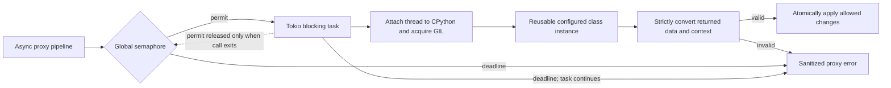

# Writing embedded Python micro-services

Tunnelbana can run synchronous Python classes in the request and response
micro-service pipeline. Use this integration for small policy, routing, and
attribute transformations that should run in the Tunnelbana process. For the
built-in Rust alternatives and general pipeline ordering, see
[Micro-services](micro-services.md).

Python modules are trusted operator code. This integration is not a sandbox:
loaded code has the operating-system permissions of the Tunnelbana process and
can import other installed modules. Review it like application code, deploy it
read-only, restrict the service account, and do not log secrets or identity
data.

## Quick start

The configured module path is an import root. A minimal deployment can look
like this:

```text
deployment/
├── proxy.toml
└── python/
    └── services/
        ├── __init__.py
        └── affiliation.py
```

Create `python/services/affiliation.py`:

```python
class AffiliationNormalizer:
    def __init__(self, name: str, base_url: str, config: dict):
        self.allowed = frozenset(config["allowed"])

    def process_response(self, context: dict, data: dict) -> dict:
        values = data["attributes"].get("affiliation", [])
        data["attributes"]["affiliation"] = [
            value for value in values if value in self.allowed
        ]
        return data
```

Configure its import and settings in `proxy.toml`:

```toml
[python]
module_path = "python"
max_concurrent_calls = 16
call_timeout_seconds = 30

[[microservice]]
type = "python"
name = "normalize-affiliation"

[microservice.config]
module = "services.affiliation"
class = "AffiliationNormalizer"

[microservice.config.settings]
allowed = ["student", "staff"]
```

The path `python` is resolved relative to `proxy.toml`, so the import root in
this layout is `deployment/python`. Tunnelbana imports only the configured
`services.affiliation` module and looks up only `AffiliationNormalizer`.
Restart Tunnelbana after changing Python source or configuration; modules and
instances are not reloaded while the process is running.

At startup, Tunnelbana fails before serving traffic if the module cannot be
imported, the class cannot be found or constructed, or its process methods are
invalid.

## Where a Python micro-service runs

Python micro-services participate in the same ordered list as Rust
micro-services:


`process_request` runs after a frontend has interpreted the downstream
authentication request and before Tunnelbana selects and calls the upstream
backend. `process_response` runs after the backend has interpreted the upstream
authentication response and before the originating frontend creates its
downstream response.

Every configured service is considered at both points. If its class does not
define the method for one direction, that direction is an identity operation.
Micro-services run in the order in which their `[[microservice]]` entries appear
in `proxy.toml` on both paths.

Python micro-services cannot register HTTP endpoints in this version.

## Class contract and lifecycle

A class has this contract:

```python
class Example:
    def __init__(self, name: str, base_url: str, config: dict):
        ...

    def process_request(self, context: dict, data: dict) -> dict:
        return data

    def process_response(self, context: dict, data: dict) -> dict:
        return data
```

The constructor receives:

| Argument | Meaning |
| --- | --- |
| `name` | The exact `microservice.name` from `proxy.toml`. |
| `base_url` | Tunnelbana's top-level `base_url`. |
| `config` | A plain dictionary containing only `[microservice.config.settings]`. It is `{}` when `settings` is omitted. |

An explicitly opted-in service may also receive a fourth constructor argument:

```toml
[microservice.config]
module = "services.scim"
class = "ScimAttributes"
pass_internal_attributes = true
```

Its constructor is then called as
`Class(name, base_url, config, internal_attributes)`. The last argument is a
detached normalized copy shaped as
`internal-name -> profile -> {names, oid, friendly_name}`. It contains
attribute names only—no state, secrets, HTTP clients, or Rust objects. This is
intended for adapters that must apply the deployment's protocol attribute map;
ordinary services should keep the three-argument constructor. See
[eduID SCIM response attributes](scim-attributes.md) for the built-in use.

Tunnelbana constructs the class once at startup and reuses that exact instance
for every request and response call. Store parsed, read-only settings on the
instance, but do not store a request's `context` or `data` for later use.
Mutable instance state is shared across calls. CPython's GIL normally
serializes Python bytecode, but native modules and blocking operations can
release the GIL, so shared state must still be concurrency-safe.

At least one of `process_request` and `process_response` must exist. Every
method that exists must be callable and must be an ordinary synchronous
function. `async def` methods are rejected at startup, and an awaitable
returned by a synchronous function is rejected at runtime. Do not call
`asyncio.run()` to work around this contract.

## Python values at the boundary

Both method arguments are fresh plain-Python copies. They contain strings,
booleans, lists, dictionaries, and `None`; no Rust objects or proxy handles are
present. These type definitions summarize the complete shapes:

```python
from typing import Literal, TypedDict

type JsonValue = (
    None
    | bool
    | int
    | float
    | str
    | list[JsonValue]
    | dict[str, JsonValue]
)


class AuthenticationInformation(TypedDict):
    auth_class_ref: str | None
    timestamp: str | None
    issuer: str | None


class InternalData(TypedDict):
    auth_info: AuthenticationInformation
    requester: str | None
    requester_name: list[str]
    subject_id: str | None
    subject_type: Literal["persistent", "transient", "public", "pairwise"]
    attributes: dict[str, list[str]]
    force_authn: bool
    is_passive: bool


class ContextSnapshot(TypedDict):
    path: str
    method: str
    query: dict[str, str]
    form: dict[str, str]
    requester: str | None
    target_backend: str | None
    target_frontend: str | None
    decorations: dict[str, JsonValue]
```

These declarations are documentation; a service does not need to copy or
import them to run.

### The `context` input

`context` describes the current proxy flow and request. It always has exactly
these keys:

| Key | Python type | Meaning | May Python change it? |
| --- | --- | --- | --- |
| `path` | `str` | Inbound HTTP path with the leading `/` removed. | No |
| `method` | `str` | Uppercase HTTP method, such as `GET` or `POST`. | No |
| `query` | `dict[str, str]` | Parsed query parameters. | No |
| `form` | `dict[str, str]` | Parsed `application/x-www-form-urlencoded` body fields; otherwise empty. | No |
| `requester` | `str \| None` | Downstream SP entity ID or OIDC client ID recovered from the flow state. | No |
| `target_backend` | `str \| None` | Name of the selected or proposed backend. | **Yes** |
| `target_frontend` | `str \| None` | Name of the frontend that originated the flow. | No |
| `decorations` | `dict[str, JsonValue]` | Non-persistent, flow-local values exchanged by pipeline components. | **Yes** |

Python may change only `target_backend` and `decorations`. It may add, replace,
or remove keys below `decorations`, provided every value remains JSON-compatible
and the reserved keys below are respected. It may not add or remove top-level
context keys. Changing `path`, `method`, `query`, `form`, `requester`, or
`target_frontend` makes the whole call fail, even if the changed value would
otherwise have a valid type.

Setting `target_backend` during `process_request` affects backend selection.
On both paths a returned `target_backend` must be `None` or the name of a
configured backend; any other string makes the whole call fail. Changing it
during `process_response` is permitted by the boundary but does not reroute
the upstream operation that has already completed. Decorations are not written
to Tunnelbana's encrypted state cookie; use them only within the current flow.

### Reserved decoration keys

Some decoration keys are read by the proxy core and other pipeline components,
not just by your own services. Treat them as security-sensitive:

- `error_redirect` - when any later pipeline step fails, the proxy issues an
  HTTP redirect to this URL *instead of* rendering a protocol error. Set it
  only from values in your `settings` table, never from `query`, `form`, or
  attribute values; a request-derived value would let a client choose where
  the proxy redirects on failure (an open redirect on your identity-proxy
  origin). The proxy only follows absolute `http(s)` URLs and ignores
  anything else, but the redirect target's host is not otherwise restricted.
- `target_entity_id`, `target_authn_context_class_ref`,
  `target_accr_comparison`, and `mfa_stepup_accounts` - upstream IdP/OP
  selection, authentication context forwarding, and SCIM output. These are
  **first writer wins** across the pipeline:
  a Python service may publish them when they are absent, but changing or
  removing a value that an earlier component (for example the discovery
  service) already set makes the whole call fail, exactly like a read-only
  field mutation. Never derive `target_entity_id` from an untrusted request
  value; that would let a client pick the upstream identity provider.
  `mfa_stepup_accounts` is SCIM-derived output, so later Python services may
  read but not replace it.
- `provider_scopes`, `provider_assurance_certifications`, and
  `requester_entity_categories` - trusted SAML metadata input. These are fully
  read-only to Python: a Python service cannot create, replace, or remove them.
  The native SAML frontend/backend publishes the authoritative arrays only
  after the relevant protocol validation.

The restricted snapshot deliberately excludes the complete URI, headers,
cookies, request body, encrypted or persistent state, secrets, HTTP client
handles, and Rust object handles.

### The `data` input

`data` is Tunnelbana's protocol-neutral authentication record. Every key is
always present, including optional values represented by `None` and empty
collections:

| Key | Python type | Meaning and normal phase |
| --- | --- | --- |
| `auth_info` | `dict` | How and where authentication occurred. Usually empty/`None`-valued on the request path and populated on the response path. |
| `requester` | `str \| None` | Downstream SP entity ID or OIDC client ID. Available on the request path and restored on the response path. |
| `requester_name` | `list[str]` | Optional display names for the requester; commonly empty. |
| `subject_id` | `str \| None` | Authenticated subject identifier; normally populated on the response path. |
| `subject_type` | one of four strings | Identifier semantics: `persistent`, `transient`, `public`, or `pairwise`. |
| `attributes` | `dict[str, list[str]]` | Internal attribute name to zero or more string values. Usually most useful on the response path. |
| `force_authn` | `bool` | Requester requires fresh authentication; mainly a request-path field. |
| `is_passive` | `bool` | Requester forbids user interaction; mainly a request-path field. |

`auth_info` also always contains every key:

| Key | Python type | Meaning |
| --- | --- | --- |
| `auth_class_ref` | `str \| None` | SAML AuthnContextClassRef or OIDC `acr`. |
| `timestamp` | `str \| None` | Authentication time, represented as an RFC 3339 string when present. |
| `issuer` | `str \| None` | Upstream IdP or OP issuer. |

The phase descriptions indicate when a field is normally useful, not a
mutation restriction. Python may return new values for any `InternalData`
field as long as the complete result is valid.

## Returning output

A process method has two output channels:

1. Return one complete `InternalData` dictionary. Returning the input `data`
   after modifying it in place is the simplest approach, but returning a new
   complete dictionary is also valid.
2. Mutate `context["target_backend"]` or `context["decorations"]` in place when
   the service needs those effects. The context dictionary itself is not the
   method's return value.

The returned `InternalData` must be a plain dictionary with exactly the eight
documented top-level keys. Its `auth_info` must be a dictionary with exactly
the three documented keys. Missing keys, extra keys, scalar attribute values,
non-string attribute values, invalid subject types, or other wrong Python types
reject the result. Returning `None`, a coroutine, or an arbitrary object also
rejects it.

The context copy is checked just as strictly after the method returns. All
read-only values must equal their original values and all decorations must
convert to JSON. Tunnelbana validates the complete context and returned data
before applying anything to the real Rust context. If validation or Python
execution fails, `target_backend`, `decorations`, and `InternalData` are left
unchanged. This rollback does not include mutable state inside the reused
Python class instance or external side effects performed by Python.

On the request path, the returned data goes to the next micro-service and then
the selected backend. On the response path, it goes to the next micro-service
and then the originating frontend. A missing process method passes the data
through unchanged.

## Configuration reference

The global `[python]` table is required if any micro-service has
`type = "python"`:

| Key | Required | Default | Meaning |
| --- | --- | --- | --- |
| `module_path` | Yes | - | One accessible import directory, absolute or relative to `proxy.toml`. It must not be empty. |
| `venv` | No | - | A virtual environment directory (absolute or relative to `proxy.toml`) the interpreter adopts for dependencies. See [Using a virtual environment](#using-a-virtual-environment). |
| `max_concurrent_calls` | No | `16` | Maximum calls admitted across all Python micro-services. Must be greater than zero. |
| `call_timeout_seconds` | No | `30` | Total deadline for semaphore waiting plus execution. Must be greater than zero. |

Each Python `[[microservice]]` has this configuration:

| Key | Required | Meaning |
| --- | --- | --- |
| `module` | Yes | Dotted Python module import, relative to `module_path`, such as `services.affiliation`. |
| `class` | Yes | Name of a Python class in that module. A factory function or other non-class callable is rejected at startup. |
| `settings` | No | TOML table converted to the constructor's `config` dictionary. |
| `pass_internal_attributes` | No | Default `false`. When true, pass a detached normalized attribute map as the fourth constructor argument. |

The global Python table and the service-level table containing
`module`/`class`/`settings`/`pass_internal_attributes` reject unknown keys. Keys inside `settings` belong
to the Python class and may have any TOML value that converts to Python. If the
class requires settings, validate them in `__init__`; raising there makes
Tunnelbana fail fast during startup.

Tunnelbana adds the one configured module directory to the interpreter's
existing import paths. It does not scan it, discover classes, import all Python
files, or install packages. Imports performed by the configured trusted module
itself still behave like normal Python imports. Provision third-party
dependencies in the image or host before Tunnelbana starts - either in a
virtual environment referenced by `venv` (recommended, see below) or in the
system site-packages; runtime `pip` installation is not supported.

The interpreter starts with CPython's *isolated configuration*: interpreter
environment variables such as `PYTHONPATH`, `PYTHONHOME`, and
`PYTHONDONTWRITEBYTECODE` are ignored, the per-user site directory
(`~/.local/lib/...`) is excluded, and bytecode caches (`__pycache__`) are
never written, so the module directory can be deployed read-only. Import
resolution therefore cannot be extended from outside the `[python]`
configuration. The standard library and the system or venv site-packages
remain importable for dependencies.

## Using a virtual environment

Set `venv` to a virtual environment directory and the embedded interpreter
adopts it exactly like a venv-launched Python: `pyvenv.cfg` is honored
(including `include-system-site-packages`), `sys.prefix` moves into the venv,
and the venv's site-packages is fully processed - `.pth` path configuration
files and editable installs included. Activation is file-based, not
environment-based: `VIRTUAL_ENV` and `PATH` are irrelevant and remain ignored
like all interpreter environment variables.

```toml
[python]
module_path = "python"
venv = "/opt/venv"
```

Your own micro-service modules stay in `module_path`, which keeps import
priority over the venv; the venv carries their third-party dependencies. The
venv must be created for the same CPython minor version Tunnelbana links
against (3.13) and must exist at startup - a missing directory, a missing
`pyvenv.cfg`, or a missing `bin/python` is a fail-fast configuration error.

In containers, create the venv with [`uv`](https://docs.astral.sh/uv/) at
image build time. For example, extending Tunnelbana's runtime image:

```dockerfile
COPY --from=ghcr.io/astral-sh/uv:latest /uv /usr/local/bin/uv

# Build the dependency venv against the same CPython 3.13 the proxy links
# against. --no-managed-python pins uv to the distribution interpreter
# instead of downloading its own.
RUN uv venv --no-managed-python --python /usr/bin/python3.13 /opt/venv \
 && uv pip install --python /opt/venv/bin/python ldap3 pyyaml
```

`uv pip install --python /opt/venv/bin/python -r requirements.txt` works the
same way for pinned dependency sets. Nothing needs to "activate" the venv in
the container entrypoint; the `venv` key in `proxy.toml` is the only wiring.

Micro-service names must be unique. Several configured Python services may use
the same module or class, but each entry receives its own class instance and
its own settings. All instances share the global concurrency limit and timeout.

## Example 1: normalize response attributes

This response-only service trims and lowercases affiliation values, removes
values not listed in settings, and de-duplicates the result without changing
its order:

```python
from typing import Any


class AffiliationNormalizer:
    def __init__(
        self, name: str, base_url: str, config: dict[str, Any]
    ) -> None:
        del name, base_url
        self.allowed = frozenset(
            str(value).strip().lower() for value in config["allowed"]
        )

    def process_response(
        self, context: dict[str, Any], data: dict[str, Any]
    ) -> dict[str, Any]:
        del context
        normalized = []
        for value in data["attributes"].get("affiliation", []):
            value = value.strip().lower()
            if value in self.allowed and value not in normalized:
                normalized.append(value)

        if normalized:
            data["attributes"]["affiliation"] = normalized
        else:
            data["attributes"].pop("affiliation", None)
        return data
```

```toml
[[microservice]]
type = "python"
name = "normalize-affiliation"

[microservice.config]
module = "services.affiliation"
class = "AffiliationNormalizer"

[microservice.config.settings]
allowed = ["student", "staff", "faculty"]
```

There is no `process_request`, so Tunnelbana treats this service as an identity
operation on the request path.

## Example 2: select a backend by requester

This request-only service routes known downstream SPs/RPs to configured
backends. The route table is controlled by the operator; it does not accept a
backend name directly from an untrusted query parameter.

```python
from typing import Any


class RequesterRouter:
    def __init__(
        self, name: str, base_url: str, config: dict[str, Any]
    ) -> None:
        del name, base_url
        self.routes = dict(config.get("routes", {}))
        self.default_backend = config.get("default_backend")

    def process_request(
        self, context: dict[str, Any], data: dict[str, Any]
    ) -> dict[str, Any]:
        requester = data["requester"] or context["requester"]
        backend = self.routes.get(requester, self.default_backend)
        if backend is not None:
            context["target_backend"] = backend
            context["decorations"]["routing_policy"] = "requester-map"
        return data
```

```toml
[[microservice]]
type = "python"
name = "route-by-requester"

[microservice.config]
module = "services.routing"
class = "RequesterRouter"

[microservice.config.settings]
default_backend = "DefaultUpstream"

[microservice.config.settings.routes]
"https://research.example/sp" = "ResearchUpstream"
"dashboard-client" = "WorkforceUpstream"
```

`ResearchUpstream`, `WorkforceUpstream`, and `DefaultUpstream` must be names of
configured `[[backend]]` entries. `routing_policy` is a JSON-compatible,
flow-local decoration that later components may inspect.

## Example 3: enforce a two-phase partner policy

A single instance may implement both directions. This example requires fresh,
interactive authentication for one requester, verifies that the response came
from the expected issuer, and releases only selected attributes:

```python
from typing import Any


class PartnerPolicy:
    def __init__(
        self, name: str, base_url: str, config: dict[str, Any]
    ) -> None:
        del name, base_url
        self.requester = config["requester"]
        self.expected_issuer = config["expected_issuer"]
        self.released_attributes = frozenset(config["released_attributes"])

    def applies(self, data: dict[str, Any]) -> bool:
        return data["requester"] == self.requester

    def process_request(
        self, context: dict[str, Any], data: dict[str, Any]
    ) -> dict[str, Any]:
        if self.applies(data):
            data["force_authn"] = True
            data["is_passive"] = False
            context["decorations"]["partner_policy"] = True
        return data

    def process_response(
        self, context: dict[str, Any], data: dict[str, Any]
    ) -> dict[str, Any]:
        del context
        if not self.applies(data):
            return data

        if data["auth_info"]["issuer"] != self.expected_issuer:
            raise ValueError("partner issuer policy failed")

        data["attributes"] = {
            key: values
            for key, values in data["attributes"].items()
            if key in self.released_attributes
        }
        return data
```

```toml
[[microservice]]
type = "python"
name = "partner-policy"

[microservice.config]
module = "services.partner_policy"
class = "PartnerPolicy"

[microservice.config.settings]
requester = "https://partner.example/sp"
expected_issuer = "https://trusted-idp.example"
released_attributes = ["mail", "givenname", "surname"]
```

If the issuer check raises, Tunnelbana aborts that pipeline call. The client
receives a sanitized proxy error; the Python exception text is not reflected
to it or copied into the server log.

## Example 4: configure two Python micro-services together

This example is deliberately complete for operators who are unfamiliar with
TOML. It configures two independent Python micro-services:

1. `FreshAuthenticationPolicy` runs on the request path. It requires fresh,
   interactive authentication for selected downstream requesters.
2. `StaticResponseAttributes` runs on the response path. It adds
   operator-configured attributes after upstream authentication.

Each service lives in a separate Python file and has separate settings. They
share the one process-wide Python runtime, module path, concurrency limit, and
timeout.

### Directory layout

Place the files beside the existing `proxy.toml` using this layout:

```text
deployment/
├── proxy.toml
└── python/
    └── services/
        ├── __init__.py
        ├── fresh_auth.py
        └── response_attributes.py
```

`__init__.py` may be empty. It makes `services` an ordinary Python package.
The configured `module_path = "python"` makes the `python/` directory the
import root.

### First service: request policy

Create `python/services/fresh_auth.py`:

```python
from typing import Any


class FreshAuthenticationPolicy:
    def __init__(
        self, name: str, base_url: str, config: dict[str, Any]
    ) -> None:
        del name, base_url
        self.requesters = frozenset(config.get("requesters", []))

    def process_request(
        self, context: dict[str, Any], data: dict[str, Any]
    ) -> dict[str, Any]:
        del context
        if data["requester"] in self.requesters:
            data["force_authn"] = True
            data["is_passive"] = False
        return data
```

This class defines only `process_request`. Its configured instance checks the
downstream SP entity ID or OIDC client ID in `data["requester"]`. A match sets
`force_authn` and clears passive authentication. On the response path its
missing `process_response` method is an identity operation.

### Second service: response attributes

Create `python/services/response_attributes.py`:

```python
from typing import Any


class StaticResponseAttributes:
    def __init__(
        self, name: str, base_url: str, config: dict[str, Any]
    ) -> None:
        del name, base_url
        self.attributes = {
            key: list(values)
            for key, values in config.get("attributes", {}).items()
        }

    def process_response(
        self, context: dict[str, Any], data: dict[str, Any]
    ) -> dict[str, Any]:
        del context
        for key, configured_values in self.attributes.items():
            current_values = data["attributes"].setdefault(key, [])
            for value in configured_values:
                if value not in current_values:
                    current_values.append(value)
        return data
```

This class defines only `process_response`. It copies its settings during
startup and appends each configured value once. On the request path its missing
`process_request` method is an identity operation.

Attribute names in this example are Tunnelbana internal attribute names. They
must agree with the deployment's attribute map and release policy.

### Complete TOML configuration

Add the following Python-related section to the existing `proxy.toml`. Keep
the deployment's existing top-level settings, frontends, and backends; they are
not repeated here.

```toml
# One global Python table is shared by every Python micro-service.
[python]
module_path = "python"
max_concurrent_calls = 16
call_timeout_seconds = 30

# The first item in the micro-service list.
[[microservice]]
type = "python"
name = "require-fresh-auth"

# These tables belong to the micro-service immediately above.
[microservice.config]
module = "services.fresh_auth"
class = "FreshAuthenticationPolicy"

[microservice.config.settings]
requesters = [
    "https://admin.example/sp",
    "operations-dashboard",
]

# A second, separate item in the same micro-service list.
[[microservice]]
type = "python"
name = "add-response-attributes"

# These tables now belong to the second micro-service.
[microservice.config]
module = "services.response_attributes"
class = "StaticResponseAttributes"

[microservice.config.settings.attributes]
support_contact = ["helpdesk@example.org"]
account_category = ["managed"]
```

The TOML punctuation is significant:

- `[python]` uses one pair of brackets because it defines one global table.
  Write it once, regardless of how many Python micro-services are configured.
- `[[microservice]]` uses two pairs of brackets because it appends one item to
  the micro-service list. The example contains it twice, so it creates two
  services.
- `[microservice.config]` belongs to the most recently declared
  `[[microservice]]`. It tells that service which Python module and class to
  load.
- `[microservice.config.settings]` also belongs to the most recent service.
  Its keys become the constructor's `config` dictionary.
- `[microservice.config.settings.attributes]` creates a nested
  `config["attributes"]` dictionary for the second class. Each TOML array
  becomes a Python list.
- Quoted strings remain strings. Do not remove the quotes around URLs, names,
  module paths, class names, or attribute values.
- The two `name` values identify different configured instances and must be
  unique. A name does not have to match the Python class name.

Tunnelbana effectively performs these two constructor calls once during
startup:

```python
FreshAuthenticationPolicy(
    "require-fresh-auth",
    "https://proxy.example",
    {
        "requesters": [
            "https://admin.example/sp",
            "operations-dashboard",
        ]
    },
)

StaticResponseAttributes(
    "add-response-attributes",
    "https://proxy.example",
    {
        "attributes": {
            "support_contact": ["helpdesk@example.org"],
            "account_category": ["managed"],
        }
    },
)
```

The actual second argument is the deployment's configured `base_url`; the URL
above is illustrative.

### What happens during a flow

On the request path, Tunnelbana walks the configured list in TOML order:

1. `require-fresh-auth` calls `process_request` and may change
   `force_authn` and `is_passive`.
2. `add-response-attributes` has no `process_request`, so it passes the
   request data through unchanged.

On the response path, Tunnelbana walks the same order:

1. `require-fresh-auth` has no `process_response`, so it passes the response
   data through unchanged.
2. `add-response-attributes` calls `process_response` and appends the two
   configured internal attributes.

Both configured objects are independent and are reused for the process
lifetime. They share `max_concurrent_calls = 16`; the value is not a separate
limit for each class.

## Execution limits, errors, and logging



Calls run on Tokio's blocking thread pool, not on async runtime workers. One
global semaphore enforces `max_concurrent_calls` across all Python services.
CPython's GIL may further serialize Python bytecode, but calls can overlap when
Python performs I/O or invokes native code that releases the GIL.

`call_timeout_seconds` covers both waiting for a semaphore permit and executing
the method. A blocking Python call cannot be killed safely. When execution
times out, the proxy stops waiting and reports an error, but the detached call
continues until Python returns and retains its semaphore permit until then.
Python code should therefore configure its own shorter timeouts for filesystem,
database, network, or subprocess operations. Enough permanently hung calls can
consume all Python capacity.

Client and protocol paths receive fixed sanitized failures. Server logs include
the micro-service name, module, class, phase, and a bounded traceback containing
stack locations. They omit exception messages and source lines because those
can contain input or configuration values. Tunnelbana never logs Python
settings, input data, returned data, secrets, headers, cookies, or request
bodies. Python code remains responsible for the safety of its own logging.

## Common mistakes

- Returning only the field that changed. Always return the complete eight-key
  `InternalData` dictionary; normally mutate and return the supplied `data`.
- Returning a scalar attribute such as `{"mail": "user@example.org"}`.
  Attribute values must always be lists, such as
  `{"mail": ["user@example.org"]}`.
- Deleting optional keys when their value is absent. Keep the key and use
  `None`, an empty list, or an empty dictionary as specified by the schema.
- Adding helper values at the top level of `context`. Put JSON-compatible
  flow-local helper values below `context["decorations"]` instead.
- Modifying `query`, `form`, `requester`, or another read-only context field.
  Tunnelbana detects the mutation and rejects all output from the call.
- Changing or removing a reserved first-writer-wins decoration
  (`target_entity_id`, `target_authn_context_class_ref`,
  `target_accr_comparison`) that an earlier pipeline component already set, or
  building `error_redirect` from a request value instead of `settings`.
- Setting `context["target_backend"]` to a name that is not a configured
  backend. The whole call is rejected, on the response path too.
- Defining `async def process_request(...)` or returning an awaitable. Embedded
  Python methods are synchronous only.
- Keeping per-request values on `self`, relying on a fresh class instance, or
  assuming calls cannot overlap. One instance is reused for the process
  lifetime.
- Performing external I/O without its own timeout. Tunnelbana's timeout cannot
  stop the underlying Python call.
- Expecting source changes or newly installed files to be discovered at
  runtime. Imports and construction happen at startup; restart the process.

## Deployment requirements

Tunnelbana embeds CPython 3.13 and links dynamically to its shared library.
Building requires the CPython 3.13 development package; reproducible builds set
`PYO3_PYTHON=/usr/bin/python3.13`. Runtime images and hosts need Python 3.13 and
the matching `libpython3.13` shared library. The repository's root and
`deploy/satosa-idp` images provide these packages.

Deploy or mount the configured module directory with the application,
preferably read-only. Install any third-party dependencies when building the
image or provisioning the host. Tunnelbana never runs `pip` at startup.
